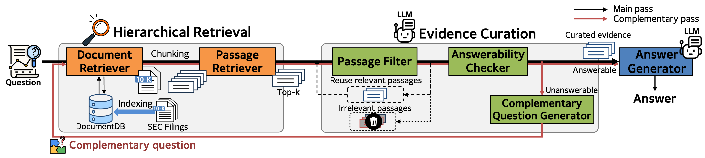

# LOFin benchmark & HiREC framework
## Hierarchical Retrieval with Evidence Curation for Open-Domain Financial Question Answering on Standardized Documents (ACL 2025 Findings)

---

## 🔍 Overview: LOFin Framework

LOFin is a financial-domain QA benchmark featuring complex multi-hop questions over standardized documents such as SEC 10-K filings.  
Our proposed framework, **HiREC**, combines hierarchical retrieval with answerability-aware generation.



The pipeline consists of:
- **Document Retriever**: Finds relevant documents.
- **Passage Retriever**: Extracts fine-grained evidence.
- **Passage Filter + Answerability Checker**: Ensures relevant, answerable input only.
- **Complementary Question Generator**: Generates a fallback query if the question is unanswerable.
- **Answer Generator**: Produces the final answer based on curated evidence.

> ⚙️ Although the **evidence curation** process includes multiple logical steps (e.g., filtering, answerability check, complementary question generation), all of them are executed through **a single LLM inference**. This makes the framework both efficient and easily extensible.

---

## 📁 Dataset Access & Security

To minimize the risk of data leakage and ensure fair benchmarking, we release the test dataset in an **encrypted format**.

- The encrypted benchmark test set can be decrypted easily by following the instructions in the [data/README.md](https://github.com/deep-over/LOFin-bench-HiREC/blob/main/data/README.md) file.
- You must **download the encrypted dataset from Google Drive** (link provided separately).
- The dataset is intended for evaluation only and should not be used for training or data leakage-prone tasks.

> 🔐 Encryption ensures the integrity of the evaluation protocol and protects against unintended usage.

The entire document collection is shared on the following drive:  
- [Google drive](https://drive.google.com/drive/u/0/folders/1Z_G6HGPFYzQaKU5fEea5_w3p7rigov_1)  
  - SEC filings are stored as **PDF** files  
  - Refer to `summarization_results.json` for first-page summaries  
  - Use the extracted `.tar` contents as the **path for the VectorDB**

---

## 🚀 Running the HiREC Framework

You can run the HiREC framework in **two different modes**, depending on whether you want to evaluate in batch or serve queries one-by-one.
> ✅ **Recommended:** We recommend using the API mode for most use cases, especially for debugging, real-time interaction, and modular development. It offers greater flexibility and is more suitable for iterative or interactive QA scenarios.

### 🔢 Common Parameters
The following arguments can be used in both modes:

- `--output_dir`: Path to save results.
- `--framework_name`: The framework being used. Ours is `finrag`.
- `--generate_method`: If set to `numeric`, it uses `Pot`; if set to `textual`, it uses `cot`.
- `--dataset`: The type of dataset to evaluate.
- `--use_gpt`: Determines the model to be used for the Evidence Curation process.
- `--max_relevant_ids`: The number of evidence items to collect.
- `--iteration`: The number of iterations for the framework.
- `--max_contexts`: The number of documents to be input in the Generator stage.
- `--use_full_page`: Determines whether the input in the Generator stage is at the passage level or the full page level.
- `--do_generate`: Whether to continue the generation process within the framework.
- `--continue_iteration`: An option to continue running after a specific number of iterations.


---

### 1. API Mode (Real-Time Single Query Execution)
This mode allows for interactive, per-query processing via the `finrag_serving` module.


You can run the server using the following command:
```bash
CUDA_VISIBLE_DEVICES=0,1,2 python finrag_serving/main.py \
    --dataset numeric_text \
    --pdf_path pdfs_v2 \
    --output_dir results \
    --db_dir vectordb/summary_document_selection \
    --debug False \
    --batch_size 32 \
    --max_new_tokens 1024 \
    --gpu_devices 0,1,2 \
    --do_generate True
```

This is the preferred method if you want to test the system one query at a time (e.g., through API integration or a debugging environment).

---

### 2. Batch Evaluation Mode
This is the original method for executing HiREC using `main_process_iter.py`.

Example command:
```bash
python main_process_iter.py \
    --output_dir results \
    --framework_name finrag \
    --generate_method numeric \
    --dataset numeric_text \
    --use_gpt gpt-4o \
    --max_relevant_ids 10 \
    --iteration 3 \
    --max_contexts 8 \
    --use_full_page True \
    --do_generate True \
    --continue_iteration False
```

If `--do_generate` is set to `False`, only the retrieval process is performed, and no GPT API key is required.

---

### 🛠 Environment Setup

Please check the `requirements.txt` file for the main environment settings:
```bash
pip install -r requirements.txt
```

### 📊 Running Baseline Experiments

Use the script `main_process_baseline.py` to run baseline systems for comparison experiments.
